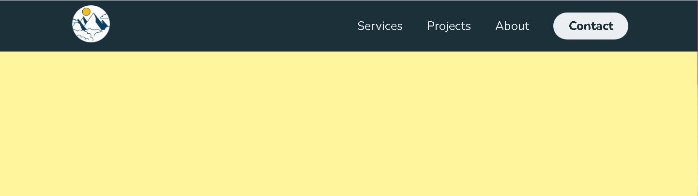
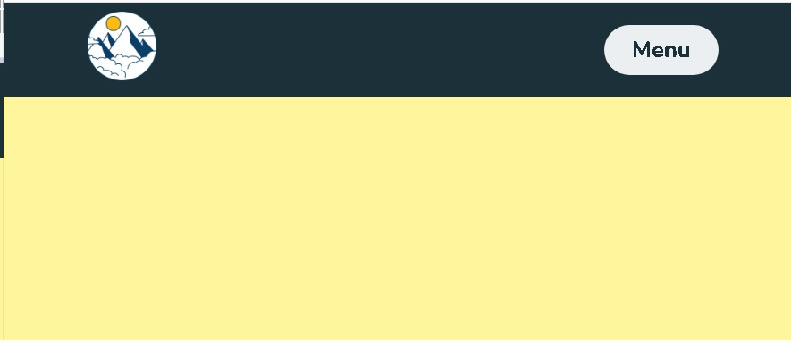

# [](https://git.io/typing-svg)

## Tarea 19: Responsive Web Design  

### Descripción

En esta tarea, se nos pide crear un diseño web responsivo utilizando CSS Grid y Flexbox. El diseño debe ser adaptable a diferentes tamaños de pantalla y  dispositivos.  

### Herramientas usadas

- **HTML5**: Para la estructura del contenido.
- **CSS3**: Para el estilo y diseño del sitio.
- **CSS Grid**: Para crear un diseño de cuadrícula flexible y responsivo.
- **Flexbox**: Para alinear y distribuir el espacio entre los elementos en el diseño.
- **Visual Studio Code**: Editor de código utilizado para el desarrollo.
- **Google Chrome DevTools**: Herramienta de desarrollo para depurar y probar el diseño.
- **Mozilla Firefox Developer Edition**: Navegador utilizado para pruebas y depuración.
- **Inspect Element**: Herramienta para inspeccionar y modificar elementos en tiempo real.

## Captura de Pantalla

## Diseño para Pantallas de Computadora



### Diseño para Pantallas de Moviles



## Estructura del Proyecto

### Archivos

- `index.html`: Contiene la estructura HTML del sitio web.
- `styles.css`: Contiene los estilos CSS que dan formato y diseño al sitio web.

## Instalación

1. **Clona el repositorio** o **descarga los archivos** del proyecto.

   ```bash
   git clone [text](https://github.com/leonaldo999/tareaClaseIdat-dia19)
